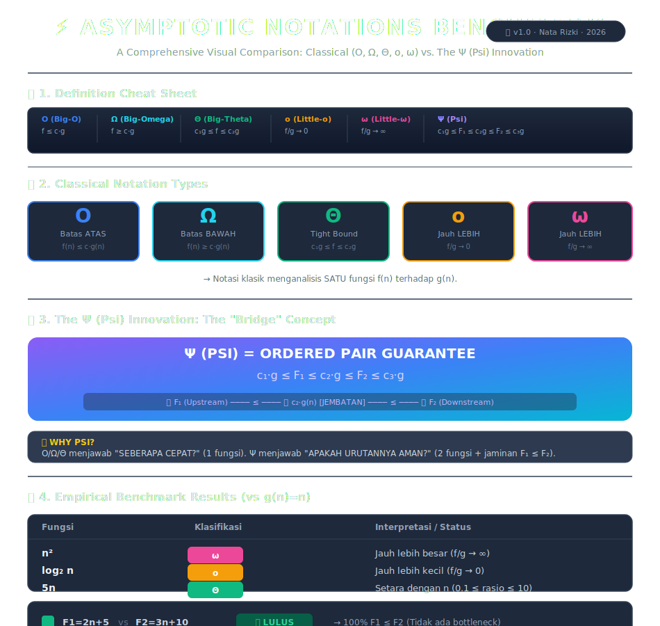

Docs: [Docs](ψ.pdf)

# The Psi (ψ) Notation for Ordered Complexity Classes

[](https://github.com/Natarizki/psi-notation)
[](https://github.com/Natarizki/psi-notation)
[](https://www.latex-project.org/)
[](https://psi-notation.vercel.app)
[](https://creativecommons.org/licenses/by/4.0/)

> A novel asymptotic notation for guaranteeing ordering constraints in two-tier computational architectures.

---

## 📜 Introduction
Classical notations (`O`, `Ω`, `Θ`) describe the *growth rate* of a **single** function. However, in modern system architectures (AI pipelines, caching layers, microservices), we require a **structural guarantee** that an upstream layer (\(F_1\)) will never exceed a downstream layer (\(F_2\)).

The **ψ (Psi) notation** fills this gap by providing a formal mathematical framework for *ordered asymptotic bounds*.

## 📐 Formal Definition
Let \(F_1, F_2: \mathbb{N} \to \mathbb{R}^+\) be a pair of non-negative functions. The ordered pair \((F_1, F_2)\) belongs to the complexity class \(\psi(g(n))\) if there exist positive constants \(c_1, c_2, c_3\) such that for all sufficiently large \(n\):

\[
c_1 \cdot g(n) \;\le\; F_1(n) \;\le\; c_2 \cdot g(n) \;\le\; F_2(n) \;\le\; c_3 \cdot g(n)
\]

The term \(c_2 \cdot g(n)\) acts as a **"Bridge"** , ensuring \(F_1\) is strictly bounded above by \(F_2\).

## 🧩 Complexity Classes
| Notation | Growth Rate | Ideal Application |
| :--- | :--- | :--- |
| \(\psi(1)\) | Constant | Real-time systems, fixed-latency hardware |
| \(\psi(\log N)\) | Logarithmic | Binary Search, B-Tree indexing |
| \(\psi(N)\) | Linear | Data streaming, ETL pipelines |
| \(\psi(N \log N)\) | Log-Linear | Sorting (Merge Sort, Quick Sort) |
| \(\psi(N^2)\) | Quadratic | Nested loops, specific DP algorithms |

## 📊 Benchmark Results
Below is a visual comparison of classical notations (O, Ω, Θ, o, ω) versus the Psi (ψ) notation, based on empirical Python tests.



**Key Takeaway:** 
- **O/Ω/Θ** tell you *how fast* a function grows.
- **ψ** tells you *if the order is safe* (\(F_1 \le F_2\)) for a pair of sequential functions.

## ⚙️ Implementation & Testing
This project includes a complete Python implementation covering:
- **Unit Tests** (Asserting \(F_1 \le F_2\))
- **Stress Tests** (10,000 iterations with random data)
- **Latency Tests** (Execution time comparison)
- **Worst-Case Simulation** (Bottleneck detection)
- **Auto-Healing** (System automatically reduces \(F_1\) load upon violation)

## 🎯 Motivation
This notation was derived to solve a practical problem in **two-tier architectures**:
> *"How do we mathematically guarantee that the retriever (F₁) doesn't flood the generator (F₂) with more requests than it can handle?"*

ψ provides a rigorous proof that \(F_1 \le F_2\) asymptotically, eliminating the need for fragile heuristic overload protection.

## 📂 Repository Structure
```

.
├── ψ.pdf                     # Full formal paper (2 pages)
├── ψ.md                      # Quick reference guide
├── README.md                 # This landing page
├── benchmark_dashboard.svg   # Visual benchmark infographic
└── index.html                # Live demo website source

```

## 🚀 Live Demo
Experience the Psi notation interactively:  
[**psi-notation.vercel.app**](https://psi-notation.vercel.app)

## 📝 Citation
If you use this notation in your research, please cite it as:

```bibtex
@misc{haynar2026psi,
  author       = {Muhammad Nata Rizki Haynar},
  title        = {The Psi (ψ) Notation for Ordered Complexity Classes},
  year         = {2026},
  howpublished = {\url{https://github.com/Natarizki/psi-notation}}
}
```

👤 Author

Muhammad Nata Rizki Haynar
https://img.shields.io/badge/GitHub-Profile-black?logo=github

---

"Bridging complexity analysis with real-world system architecture."
